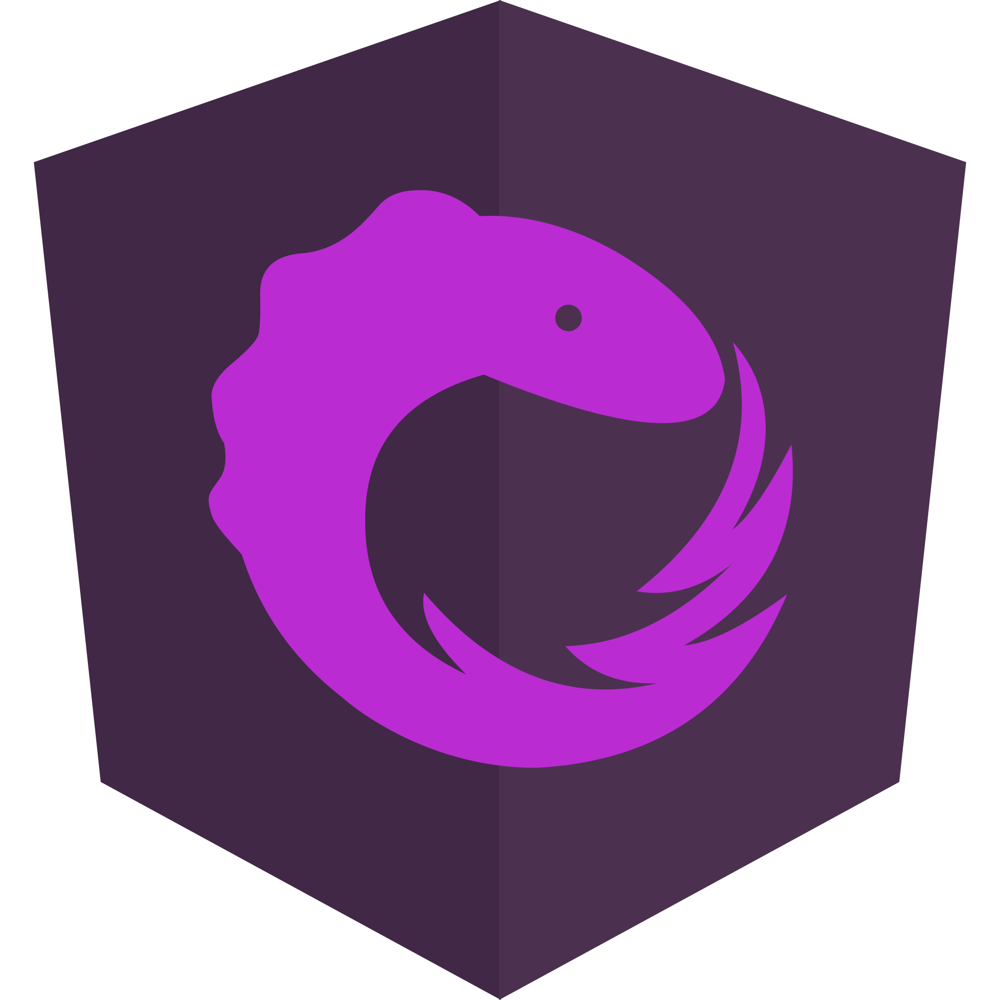
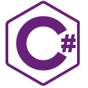

## Hi there 👋, I'm Darge98 

<!-- Reddit? Youtube? Twitch? Medium?-->

I'm a **Software Developer** and I'm always looking for personal improvement.

I love study new technology and I love find a solution for your problem.

I start develop when I was 17 years old in a Technical Institue.
I got out of school in 2017 and I started work in the same year.

---

🧰 Toolbox

   
 
      
 
 
 
  
 

 

---

